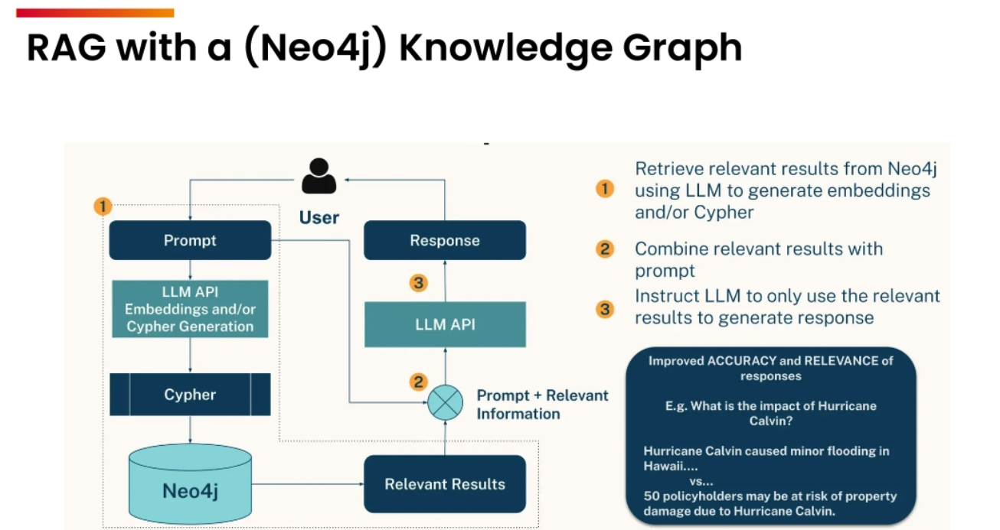

# graphrag-temp

This is a basic OSS pattern to use for GraphRAG.  Extremely rough.  

GraphRAG uses knowledge graph - style databases. 

* vs RAG you tend to get more specific entities and specific answers due to the relationships
* RAG will utterly fail at certain styles of questions that are more complicated than simple summarization or classification. In other words, simple regurgitation of data.   
* for example...aggregate-analysis -style questions
  * What are the Top 5 themes of this data?  
  * What are the questions I should be asking about this dataset?  

_Knowledge Graphs allow searching for things, not strings_

## Knowledge Graphs and Graph Databases

[Knowledge Graphs](./knowledge-graphs.md)

[Populating the KG](./populating.md)

## GraphRAG:  RAG with a KG

### Notebooks

* [Start here](./notebooks/00-Neo4j.ipynb)
* [How to get the data into neo4j](./notebooks/20-data-mining.ipynb)
* [GraphRAG patterns](./notebooks/GraphRAG.ipynb)

The one thing I don't have ready is how to build the ontology and schema using chatgpt.  This is how I do it.  Roughly, the process is outlined in the other files in this repo, but it needs better documentation.  It's conversational and once you understand the basics you can do it on your own.  **By far, this is the biggest hurdle to overcome with the implementation.**

# Demos and Internal stuff

* The working demo using Azure stuff is in other repo, can't be shared currently.  see README
* for internal implementation see graphrag.md